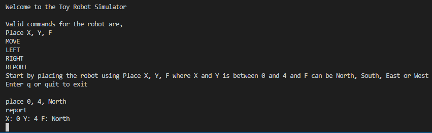

# robot

This project simulation of a toy robot moving on a square tabletop, of dimensions five units by five units. There are no other obstructions on the table surface. The robot is free to roam around the surface of the table but will be prevented from falling to destruction. Any movement that would result in the robot falling from the table will be restricted, however further valid movement commands will be allowed.

The application uses the following technologies:

- Backend: NodeJs
- Type Checking: Typescript



## Getting Started

```bash
npm install
npm start
```

There are five valid commands for the robot:

```
- PLACE X,Y,F     - places the robot on the tabletop. X and Y is between 0 and 4 and F can be North,                    South, East or West
- MOVE            - Moves the robot one unit towards the direction it is facing
- LEFT            - Rotates the robot by 90 degrees to the left (anticlockwise)
- RIGHT           - Rotates the robot by 90 degrees to the right (clockwise)
- REPORT          - Reports the current position of the robot
```

Commands can also be read from a file. <b>The file path is relative to ./src/app.ts</b>. Pass the file path as an argument shown below.

```bash
npm start commands.txt
```

## Scripts

```
- npm run eslint           - will run the linter checks
- npm test                 - will run all the tests
- npm run coverage         - will generate code coverage reports
- npm run build            - will generate generate .js from the .ts files for production use
- npm run build:watch      - will generate generate .js from the .ts files for production use and                                watch for changes
- npm start                - will start the robot simulator app
```

## Project Structure

### Overall Structure

1. The `test` directory contains all the unit and integration tests.
2. The `src` directory contains the all the source code including the app.ts file.
3. The `config` directory contains all the site specific configs.
4. The `dist` directory contains all compiled js files.

## Development

This project uses EditorConfig to standardize text editor configuration.
Visit http://editorconfig.org for details.

This project uses ESLint to detect suspicious code in JavaScript files.
Visit http://eslint.org for details.

### Testing

This project uses jest.
Visit https://jestjs.io/ for details.

To execute tests:

```bash
npm test
```

To calculate coverage:

```bash
npm run coverage
```

The coverage reports will be in the `coverage` folder

## FAQ

## Credits

Written by Shahriar Hasan Khan
Contact: shahriar27@hotmail.com
